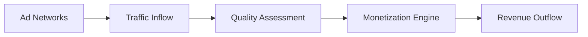

## Overview

ATSystems treats ad traffic as a raw material sourced from diverse ad networks, which act like fragmented markets with inconsistent APIs and rules. You integrate with dozens of these networks, normalize their chaotic data into a unified model, and leverage algorithms for real-time decisions on bids, bundles, deactivations, and redistributions. This automation replaces manual processes or intuition-based approaches, enabling scalable optimization and monetization.

<Callout kind="info">
  These core concepts form the foundation for building high-performance ad traffic systems.
</Callout>

## Key Concepts

Visualize the four pillars of ATSystems architecture using these feature cards.

<Columns cols={2}>
  <Card title="Traffic as Raw Material" icon="zap">
    Ad traffic flows in from multiple sources. You process it like commodities—volume, quality, and cost determine value.
  </Card>

  <Card title="Ad Networks as Markets" icon="globe">
    Each network has unique APIs, rules, and pricing. ATSystems handles this fragmentation seamlessly.
  </Card>

  <Card title="API Normalization" icon="database">
    Convert disparate APIs into a single data model for consistent analysis and decision-making.
  </Card>

  <Card title="Data-Driven Decisions" icon="trending-up">
    Algorithms analyze data to set bids, bundle traffic, and redistribute resources dynamically.
  </Card>
</Columns>

## Traffic as Raw Material and Ad Networks as Markets

You source traffic from networks like Google Ads, Facebook Ads, and programmatic exchanges. Each acts as a market with varying supply curves, latency, and compliance rules.



This model ensures you treat traffic objectively, prioritizing high-value streams.

## API Normalization and Unified Data Model

Normalize APIs from 20+ networks into one schema. For example, map varying response formats to a common `{bidRequest}` object.

<CodeGroup tabs="JavaScript,Python">
  ```javascript
  // Raw response from Network A
  const rawA = { id: "123", price: 0.05, fillRate: 0.85 };

  // Normalized model
  const normalized = {
    requestId: rawA.id,
    cpm: rawA.price * 1000,
    fillRate: rawA.fillRate,
    network: "NetworkA"
  };

  console.log(normalized); // { requestId: "123", cpm: 50, fillRate: 0.85, network: "NetworkA" }
  ```

  ```python
  # Raw response from Network B
  raw_b = {"campaign": "abc", "ecpm": 0.045, "completion": 0.92}

  # Normalized model
  normalized = {
      "request_id": raw_b["campaign"],
      "cpm": raw_b["ecpm"] * 1000,
      "fill_rate": raw_b["completion"],
      "network": "NetworkB"
  }

  print(normalized)
  ```
</CodeGroup>

<Callout kind="tip">
  Use TypeScript interfaces for strict typing in production:
  ```typescript
  interface UnifiedBid {
    requestId: string;
    cpm: number;
    fillRate: number;
    network: string;
  }
  ```
</Callout>

## Data-Driven Decision Algorithms

Implement algorithms for bids and redistributions. Here's a simple bid optimization:

<Steps>
  <Step title="Fetch Metrics" icon="database">
    Query unified data model for recent performance.
  </Step>

  <Step title="Calculate Optimal Bid" icon="calculator">
    Use formula: `optimalBid = baseCPM * (1 + qualityScore * 0.2)`.
  </Step>

  <Step title="Apply Decision" icon="zap">
    Submit to networks via normalized API.
  </Step>

  <Step title="Monitor and Adjust" icon="trending-up">
    Feedback loop updates models in real-time.
  </Step>
</Steps>

Example in action:

```javascript
function calculateBid(baseCPM, qualityScore) {
  return baseCPM * (1 + qualityScore * 0.2);
}

// Usage
const optimal = calculateBid(45, 0.9); // Returns 63
console.log(`Bid: ${optimal}`); // Bid: 63
```

## Automation vs. Manual Processes

<Tabs>
  <Tab title="Manual Approach" icon="user">
    Rely on spreadsheets and gut feel. Slow, error-prone, scales poorly for high-volume traffic.
  </Tab>

  <Tab title="ATSystems Automation" icon="settings">
    Algorithms process millions of impressions per second. Decisions based on data, not intuition.
  </Tab>
</Tabs>

<Expandable title="Advanced: Custom Algorithm Integration" default-open="false">
  Extend with your ML models:

  ```javascript
  async function customDecision(trafficData) {
    const modelResponse = await fetch('https://api.example.com/ml-predict', {
      method: 'POST',
      body: JSON.stringify(trafficData)
    });
    return await modelResponse.json();
  }
  ```
</Expandable>

Master these concepts to build resilient ad systems that outperform manual operations.