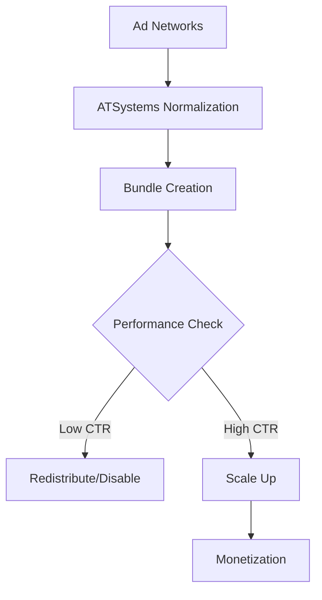

## Supported Ad Networks

ATSystems supports integration with over 20 major ad networks out of the box. You select networks via the dashboard and configure credentials to start pulling traffic data.

<Columns cols={3}>
  <Card title="Google Ads" icon="google" href="https://dashboard.example.com/integrations/google">
    High-volume search and display traffic with advanced bidding APIs.
  </Card>
  <Card title="Facebook Audience Network" icon="facebook" href="https://dashboard.example.com/integrations/facebook">
    Native, interstitial, and rewarded video formats across apps and sites.
  </Card>
  <Card title="Taboola" icon="activity" href="https://dashboard.example.com/integrations/taboola">
    Native content recommendations with customizable widgets.
  </Card>
  <Card title="Outbrain" icon="trending-up" href="https://dashboard.example.com/integrations/outbrain">
    Amplify native ads through publisher partnerships.
  </Card>
  <Card title="AdMob" icon="phone" href="https://dashboard.example.com/integrations/admob">
    Mobile app monetization with mediation support.
  </Card>
  <Card title="Magnite" icon="dollar-sign" href="https://dashboard.example.com/integrations/magnite">
    Header bidding and direct deals for publishers.
  </Card>
</Columns>

<Callout kind="tip">
  Check the [dashboard](https://dashboard.example.com/integrations) for the full list and real-time status. New networks added quarterly.
</Callout>

## Step-by-Step Integration Process

Follow these steps to connect any supported ad network. The process normalizes disparate APIs into ATSystems' unified data model.

<Steps>
  <Step title="Obtain Credentials" icon="key">
    Log into the ad network dashboard and generate API keys or OAuth tokens. Note the client ID, secret, and refresh token if required.

    <ParamField header="Authorization" param-type="string" required="true">
      Bearer token format: `Bearer YOUR_TOKEN`.
    </ParamField>
  </Step>

  <Step title="Configure in ATSystems" icon="settings">
    Navigate to `https://dashboard.example.com/integrations` and select your network. Paste credentials and set traffic filters like geo or device type.
  </Step>

  <Step title="Normalize and Map Data" icon="database">
    ATSystems auto-maps fields like bid price, CTR, and RPM. Review and adjust mappings in the normalization editor.
  </Step>

  <Step title="Test and Activate" icon="play">
    Run a test pull to verify data flow. Monitor for errors, then enable live traffic optimization.
  </Step>
</Steps>

## Handling API Variations and Rules

Ad networks expose chaotic APIs with unique rate limits, auth flows, and response formats. ATSystems handles 90% automatically, but you may need custom rules for edge cases.

<Tabs>
  <Tab title="Google Ads" icon="google">
    Use OAuth 2.0 with scopes for reporting.

    <CodeGroup tabs="JavaScript,Python">
      ````javascript
      const { google } = require('googleapis');
      const auth = new google.auth.OAuth2(CLIENT_ID, CLIENT_SECRET, REDIRECT_URI);
      const response = await auth.getAccessToken({code: AUTH_CODE});
      console.log(response.access_token);
      ````

      ````python
      from google.oauth2.credentials import Credentials
      from googleapiclient.discovery import build

      creds = Credentials.from_authorized_user_file('token.json')
      service = build('adsreporting', 'v202409', credentials=creds)
      reports = service.accounts().reports().run(body=REPORT_REQUEST).execute()
      print(reports)
      ````
    </CodeGroup>
  </Tab>

  <Tab title="Facebook" icon="facebook">
    Graph API requires app review for production.

    <Request show-lines="true">
      ````bash
      curl -X POST \
        "https://graph.facebook.com/v20.0/{ad-account-id}/insights" \
        -H "Authorization: Bearer {ACCESS_TOKEN}" \
        -d "fields=impressions,cpm,ctr&date_preset=last_7d"
      ````

      ````json
      {
        "data": [
          {"impressions": "15000", "cpm": "2.50", "ctr": "0.015"}
        ]
      }
      ````
    </Request>
  </Tab>
</Tabs>

## Bundle Creation and Traffic Redistribution

Create bid bundles to group similar traffic sources and automate redistribution based on performance.

<CodeGroup tabs="JavaScript,Python">
  ````javascript
  // Create bundle via ATSystems API
  const response = await fetch('https://api.example.com/v1/bundles', {
    method: 'POST',
    headers: { 'Authorization': 'Bearer YOUR_API_KEY', 'Content-Type': 'application/json' },
    body: JSON.stringify({
      name: 'High-CTR Mobile',
      networks: ['google', 'admob'],
      rules: { min_ctr: 0.01, geo: ['US', 'CA'] }
    })
  });
  const bundle = await response.json();
  console.log(bundle.id);
  ````

  ````python
  import requests

  payload = {
      'name': 'High-CTR Mobile',
      'networks': ['google', 'admob'],
      'rules': {'min_ctr': 0.01, 'geo': ['US', 'CA']}
  }
  headers = {'Authorization': 'Bearer YOUR_API_KEY', 'Content-Type': 'application/json'}
  response = requests.post('https://api.example.com/v1/bundles', json=payload, headers=headers)
  print(response.json()['id'])
  ````
</CodeGroup>



<Callout kind="alert">
  Always set rate limits in rules to avoid API bans. Monitor via `https://dashboard.example.com/traffic`.
</Callout>

<Expandable title="Advanced Redistribution Rules" default-open="false">
  Use custom scripts for dynamic bidding:

  ````javascript
  function redistribute(trafficData) {
    return trafficData.map(source => ({
      ...source,
      bid: source.ctr > 0.02 ? source.baseBid * 1.2 : source.baseBid * 0.8
    }));
  }
  ````
</Expandable>